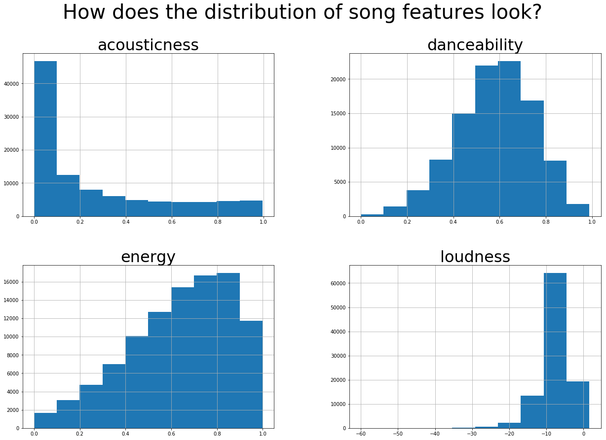

## Data Cleaning and Reconciliation
#### Our source data was well structured, and contained primary/foreign key pairs that facilitated cross-referencing information from the MPD and API. The main objectives of our data cleaning and reconciliation process were to:
1. Extract data from 1,000 individual Million Playlist Dataset CSVs into a single dataframe.
2. Cross-reference the MPD with the API to incorporate artist and track features for analysis and prediction.
3. Filter playlists that would not be good candidates for training or prediction due to their small size or the relative obscurity of their tracks.

#### We took the following data cleaning and reconciliation steps:
1. Combine the Million Playlist Dataset CSVs into a single dataframe
2. Assign a unique pid each playlist, such that the first 3 characters are the serial number of the source data CSV and the last three characters are the original `pid` in the source file.
3. Count the number of appearances of each `track_uri` in the Million Playlist Dataset
4. Create track dataframe by calling the `audio-features` API on the top 100,000 `track_uris`
5. Create artist dataframe by calling the `artist` API for unique `artist_uri`s in track dataframe
6. Downselect playlist dataframe to those with >100 tracks and containing only songs from top 100,000 tracks
7. Cross-reference the playlist, artist, and track data using `track_uri` and `artist_uri` as foreign keys

## Exploratory Data Analysis
#### Initial Explorations: What is the composition of playlists in the cleaned dataset?
First, we investigate the high-level composition of our cleaned dataset. How many playlists and tracks do we have? How many tracks are on a playlist? Do some tracks appear more than others? These inputs help to scope further EDA and model selection

Initial Explorations: What is the composition of playlists in the cleaned dataset?
First, we investigate the high-level composition of our cleaned dataset. How many playlists and tracks do we have? How many tracks are on a playlist? Do some tracks appear more than others? These inputs help to scope further EDA and model selection

The plots above show immediately the impact of our playlist selection criteria on the dataset that will be used for training, testing, and validating our models. The number of songs per playlist is not normally distributed, and we only have playlists that include more than 100 songs. Additionally, 18% of songs are on 90% of playlists, so we can expect overlap of songs between playlists.

#### What relevant data do we have about the tracks?
In this section we tried to analyse the song level data, to guess what feature transforms may be required when fitting models later. We wanted to see the distribution of the features, to analyse things like outliers and missing values, and see if we could use our results to guide any potential feature selection or feature augmentation choices. For brevity, we present a subset of the feature histograms here, clearly showing that the distributions vary largely. For instance, acousticness seems to follow something akin to a power law distribution, while danceability is more normal. Some features like loudness have a lot of values in one region, and a few potential outliers.

Next, we examine feature correlations to find any redundant features. We find that acousticness is negatively correlated with loudness and energy. Loudness is in turn correlated positively with energy, and negatively with instumentalness. Apart from these, there seems to be no particular multicollinearity, and no features can be discarded entirely as redundant. We now hypothesize that these features are more similar within a playlist, and different across playlists, and examine these claims further in the following sections.

#### Do track features differentiate playlists?
Finally, we investigate the relationship of songs in a playlist, and between playlists.  We wanted to know whether playlists in our training set tend to be built from songs that are similar to each other or songs that are different from each other. If playlists tend to be composed of songs that all have similar features, we could use information about the distribution of feature scores in a stub playlist to recommend additional songs for the playlist.

First, we consider if playlists separate in song-feature space, based on the features of individual tracks. We find that, for various arbitrarily selected pairs of song features, there was little semantic separation of playlists. A visualisation for one such pair: valence and danceability. Note that most of the points are in the center, where there is extremely high variance in colors. It seems like regions on the plot edges are acceptable, but this is actually due to dearth of data (large regions, defined by single points), and is not representative of the songs genuinely falling into clusters.

Next, we consider whether the average features of an individual playlist differentiate it from other playlists. We calculated the gini index for each song feature by playlist. To measure the average within-playlist similarity of songs, we took the mean of the gini index for each playlist. To measure the average between-playlist similarity, we took the gini index of the mean feature scores for each playlist.

We find that, as illustrated in the above scatterplot, playlists are, on average, composed of songs that have similar features, particularly danceability, duration, energy, tempo, and valence. However, our exploratory data analysis doesn’t find that playlists vary greatly in individual features. This could be because the majority of playlists in the sample data used to generate this plot are actually similar to each other; for example, this could be the case if most playlists are composed of Top 100 pop songs. However, if this is instead because even playlists with different moods/contexts have songs with similar features, then this could mean that a model that discriminates between new songs based on the features of songs in a stub playlist struggles to match the intended context/mood of the stub playlist.

Given that individual song features do not differentiate individual playlists, we next plan to consider the group characteristics of groups of playlists. We propose k-means clustering on the full training dataset in an attempt to algorithmically identify natural clusters of playlists in high-dimensional space, which could in turn be used to build a distribution of songs likely to mesh well with a playlist in a given cluster.
