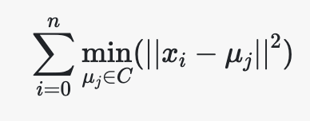
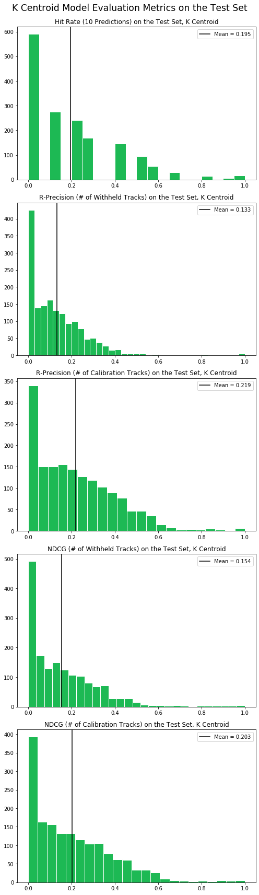

## k-Centroid Model

### Overview
Provided a list of tracks selected by a user, we can evaluate the distribution of features in these tracks, identify a cluster of similar playlists, and recommend additional tracks for the user that are appear frequently in the cluster.

#### K-Centroid = k-Means + k-NearestNeighbor
We first use k-means clustering on the full training dataset of 13084 playlists in an attempt to algorithmically identify natural clusters of playlists in high-dimensional space. Next we use the  playlists (with cluster labels) to build a  to build a frequency distribution of songs likely to mesh well with a playlist in a given cluster. Finally, we fit a k-NearestNeighbors model to predict the nearest cluster for a given playlist, and use this cluster to recommend songs from the frequency distribution.

#### Cluster Identification - k-Means
We used k-Means Clustering to identify groups of playlists that have similar features. k-Means Clustering is an unsupervised machine learning algorithm which groups similar observations together in a fixed number of `k` clusters to discover underlying patterns.

The k-Means algorithm tries to cluster data by separating observations into groups of equal variance. Based on the model parameters, namely the number of clusters `k`, and a vector of unlabeled input data, the k-Means algorithm first proposes a center for each cluster. Next, it assigns each data point to its nearest cluster centroid. Then, it iterates over the cluster centers in an attempt to reduce `inertia` - the within cluster sum of squares. The algorithm continues to iterate until it converges to an inertia value that is below a threshold. 

As k-Means is unsupervised, it is a powerful method for identifying patterns in unlabeled data where the ground truth is not known. Given that our exploratory data analysis found that individual song features do not differentiate individual playlists, k-Means Clustering allows us to consider the group characteristics of groups of playlists in the absence of manually labelled groupings. This gives us a baseline from which to build a k-NearestNeighbor model to classify heretofore unseen playlists in clusters of similar playlists. 

#### Cluster Prediction - k-NearestNeighbor

### Data Preparation

#### Playlist Features

#### Track Frequency

### Methodology

### Model Performance and Results

